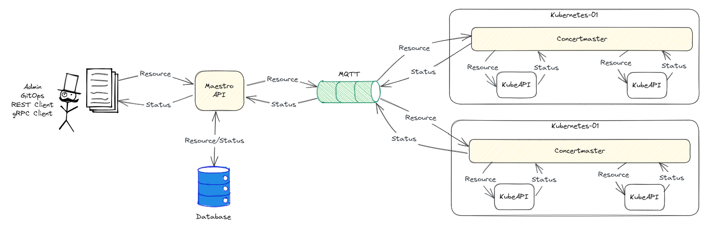

# Maestro

Maestro is a component of the Kube Orchestra Project, a multi-cluster resources orchestrator for Kubernetes.

Maestro is the API for cluster registration and single-cluster resources definition.

## Kube Orchestra Architecture



## Development

```
$ go install github.com/grpc-ecosystem/grpc-gateway/v2/protoc-gen-grpc-gateway
$ go install google.golang.org/protobuf/cmd/protoc-gen-go
$ go install google.golang.org/grpc/cmd/protoc-gen-go-grpc
$ go install github.com/grpc-ecosystem/grpc-gateway/v2/protoc-gen-openapiv2
$ buf generate
$ go run cmd/server/main.go
```

## Test

```
~/go/src/github.com$ curl -s -X GET http://localhost:8090/v1/consumers | jq
{
  "consumers": [
    {
      "id": "1",
      "name": "Foo",
      "labels": []
    },
    {
      "id": "2",
      "name": "Bar",
      "labels": []
    }
  ]
}
```

```
$ curl -s -X GET http://localhost:8090/v1/consumers/1 | jq
{
  "id": "1",
  "name": "Foo",
  "labels": []
}
```

Open http://0.0.0.0:8090/swagger-ui
